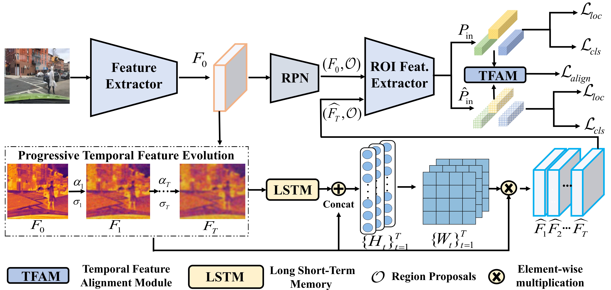

# Simulating Distribution Dynamics: Liquid Temporal Feature Evolution for Single-Domain Generalized Object Detection

[ [Paper][Simulating Distribution Dynamics: Liquid Temporal Feature Evolution for Single-Domain Generalized Object Detection](https://arxiv.org/pdf/2511.09909)) ]

## Overview

Single-Domain Generalized Object Detection (Single-DGOD) aims to train an object detector using only a **single-source domain**, while maintaining strong robustness across multiple unseen domains.

In this work, we propose **Liquid Temporal Feature Evolution (LTFE)**, a novel framework that models **continuous distribution dynamics** instead of relying on discrete augmentation or static domain simulation. LTFE progressively simulates the evolution trajectory of feature distributions from the source domain toward latent unseen domains through temporal modeling and liquid neural parameter adaptation, enabling smooth and adaptive cross-domain generalization.

------

<p align="center">    </p> <p align="center"> <b>Figure 2.</b> Overview of the proposed <b>Liquid Temporal Feature Evolution (LTFE)</b> framework.  LTFE simulates progressive feature evolution from the source domain to latent distributions via temporal modeling and liquid parameter adaptation, enabling robust generalization to unseen domains. </p>

### Installation
Our code is based on [Detectron2](https://github.com/facebookresearch/detectron2) and requires python >= 3.8

Install the required packages
```
pip install -r requirements.txt
```

### Datasets
Set the environment variable DETECTRON2_DATASETS to the parent folder of the datasets

```
    path-to-parent-dir/
        /diverseWeather
            /daytime_clear
            /daytime_foggy
            ...
        /comic
        /watercolor
        /VOC2007
        /VOC2012 
```
### Training
We train our models using four NVIDIA RTX 4090 GPUs.

```
python train.py --config-file configs/diverse_weather_c.yaml 
```

### Citation
```bibtex
@inproceedings{LTFE,
  title={Simulating Distribution Dynamics: Liquid Temporal Feature Evolution for Single-Domain Generalized Object Detection},
  author={Zihao Zhang and Yang Li and Aming Wu and Yahong Han},
  booktitle={Proceedings of the AAAI Conference on Artificial Intelligence},
  year={2026}
}

```
